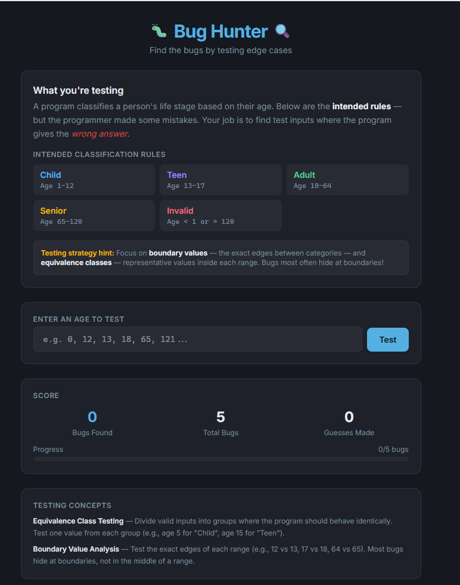

# Vibe Coding Mini Project: Test Case Analysis

Revised: 4/3/2026

## Vibe Coding Test Case Analysis Instructions (General)

- Research the test case topic for the week, e.g. **Equivalence Classes/Boundary Values**.
- You can focus on one or more of the types of test cases for the week.
- Using an Agentic AI tools, e.g. ChatGPT, Git Hub Copilot, Claude Code, Replit, etc., write come code or create an app using "no code" that illustrates the Test Case for the Week.  

## Think out of the box and get creative

- The purpose of the assignment is to gain more experience with software testing while gaining skills with Agentic coding assistant tools.   
- With the no code tools, you can program anything that you can think of.  
- Here is a screen shot of a game that I created live in class.  This illustrates interactive black box testing techniques, in this case, Equivalence Classes/Boundary Values. 
- Can you think of a more creative way to illustrate the techniques?  Can ChatGPT think of any good ideas?  

### Bug Hunter Screen Shot Created in Replit 

## Current Schedule

| WEEK DUE | TOPIC |
|----------|-------|
| 3 | Equivalence Classes/Boundary Values |
| 5 | Decision Tables/Pairwise Testing |
| 7 | State Transitions/ Control Flow Testing/ Data Flow Testing |

## Rubric Summary for Writeup (Markdown format)

| CRITERIA | SATISFACTORY | FAILING |
|----------|-------------|---------|
| **Introduction** | Introduction describes the test case methodology. Include an analysis of when the test case should be used and the limitations. | Introduction is missing. |
| **Vibe Coding Assignment** | Code a sample app in the language of your choice that illustrates how the test case is applied. Include Sunny Day and Rainy Day scenarios. Include screen shots of the app and small snippets of the code when it makes sense. You can also code this by hand using a language like Python or Java, but this is not encouraged.  If you do it this way, you can write Unit Tests to illustrate the test cases.  | Screen shots of sample app are missing. |
| **Conclusion** | What problems did you have? What did you learn about the AI tools? | Conclusion is missing. |

## What to Submit

Submit your Vibe Coding Assignment Writeup in markdown format in your Git Hub Repo.

