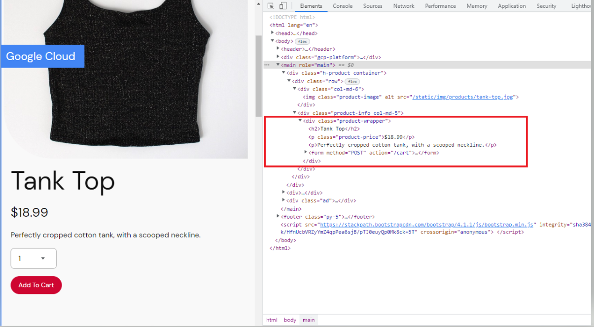
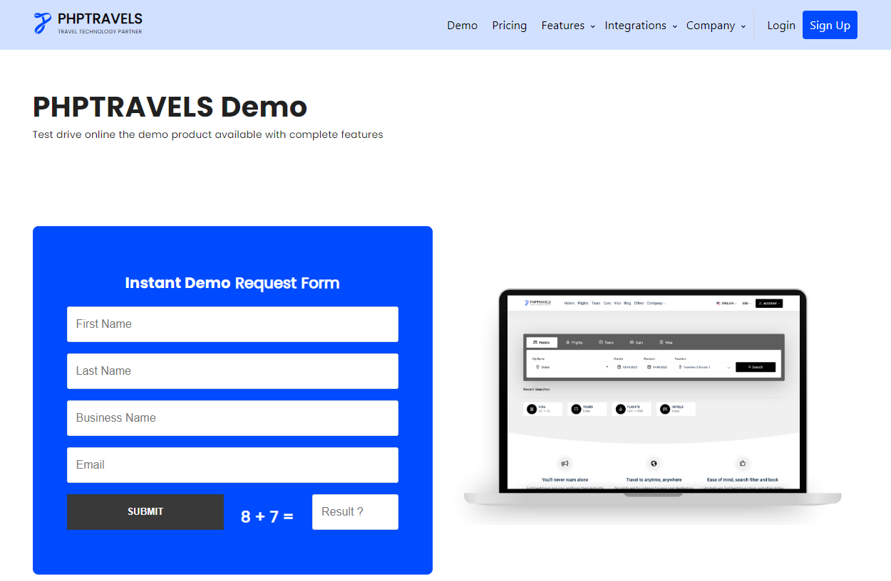

# Project 4: User Testing with Selenium

**Revised: 4/9/26**

## General Instructions

### Group Work

This can be a group collaboration assignment. You will need to choose a partner for this project. If you would like to work individually, you can do that too. If you work as a group, but both names on your assignment. Let me know your groups in Slack.

### Introduction

- You may use Selenium Desktop or you may use a programming language (Java, Python, etc.) to automate these tests with a program outside of the Selenium Desktop application.
- You can vibe code a webpage or deploy the Google online boutique demo app.
- Clone the repo and adapt the instructions to deploy in the Kubernetes environment of your choice.
  - <https://github.com/GoogleCloudPlatform/microservices-demo>
- If you don't have knowledge of Kubernetes or cloud collaborate with a team with these skills. Deployment options include:
  - Docker Desktop
  - Podman
  - Any of the major cloud providers
- If you run into any particular snags with a website, you may adapt the assignment with the instructors approval.
- If you get really stuck, you can adapt the assignment to point to a different site that is used for Selenium testing.

## Getting Started: Research Install Selenium IDE and Developer Tools

### Research

1. Research Selenium.

### Install Selenium

1. In Firefox, navigate to "Add Ons"
2. Go to "Extensions"
3. Search for Selenium IDE
4. Click "Add to Firefox"
5. Ensure that you have the Developer Tools in your Browser so that you can inspect code. Developer tools allow you to see the code side-by-side with the website and allow you to hover over part of the page to quickly see the code that goes with that part of the page. Make sure you understand how to use these tools before moving on.

### Developer Tools in Google Chrome

## Part 1: Lab Procedure

Script a Selenium test that automate the following test case:

1. Go to the Online Boutique (see above)
2. Find an item of your choice
3. Add it to the cart
4. Verify the dollar amount in the cart matches correct total for the book and print a pass/fail message
5. Post a screen shot of your executed test.

### If you get stuck . . . Alternate Procedure

Test on a public site. For this lab you need to create 3 different tests.

1. Pick a publicly available website. It can be any type of website, but you will want to avoid websites with advanced security for logging in. You can search for sites that are good for testing Selenium. Any site you choose should have "tags" that can be used in your Selenium program.

   For example, <https://www.techbeamers.com/websites-to-practice-selenium-webdriver-online/>

   <https://phptravels.com/demo/>

   

2. Write a brief user story for each of the 3 tests so I understand what the test is supposed to be doing.

3. Write 3 different Selenium tests. They should be something like:

   **Example 1: Ecommerce System**
   - Create a user account / validate the account was created properly
   - Login / validate login
   - Search for a thing / see if it exists or does not exist
   - Add the thing to your shopping cart and verify the item and cost
   - Delete the thing from your shopping cart

   **Example 2: Blog/Discussion Forum**
   - Create an account on Reddit / validate the account was created correctly
   - Submit a post on reddit
   - Find a post and post an automated reply
   - Look for a post created by a particular user

4. Create a video demo or Word doc that describes what you've done, how to setup and run the tests.

## Rubric Summary

| CRITERIA | QUESTIONS TO ADDRESS |
|---|---|
| **Introduction** | Proved an overview of the project. Describe the testing including your setup, how you ran the tests (for both Part 1 and Part 2, Desktop, program, etc.). |
| **Cover the following points** | Video demo or paper screen shots of tests. |

## Submit your Project #4 in markdown format in your Git Hub Repo.

- If you worked as a team, include all team members on the paper.

## Resources

- <https://github.com/GoogleCloudPlatform/microservices-demo>
- <https://www.google.com/search?q=selenium+tutorial+for+beginners&oq=selenium+tot&aqs=chrome.2.69i57l5.8965j0i4&sourceid=chrome&espv=210&es_sm=93&ie=UTF-8>
- <https://phptravels.com/demo/>

