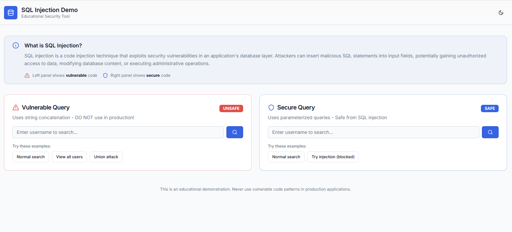
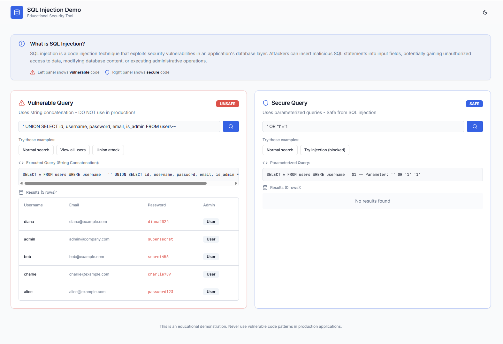

# Vibe Coding Projects

## Overview (THIS SINGLE DOCUMENT PROVIDES INSTRUCTIONS FOR ALL ASSIGNMENTS)

- We will use Vibe Coding to explore the OWASP top 10 
- There are three assignments due Week 3, 5, and 7. 
- Choose one of the top ten vunerabilities and create a Vibe Coding Assignment to help learn about these vulnerabilties.  

## OWASP Top 10:2025

| ID | Category |
|----|----------|
| A01:2025 | Broken Access Control |
| A02:2025 | Security Misconfiguration |
| A03:2025 | Software Supply Chain Failures |
| A04:2025 | Cryptographic Failures |
| A05:2025 | Injection |
| A06:2025 | Insecure Design |
| A07:2025 | Authentication Failures |
| A08:2025 | Software or Data Integrity Failures |
| A09:2025 | Security Logging and Alerting Failures |
| A10:2025 | Mishandling of Exceptional Conditions |

## Part 1: 

- Explore a Vibe Coding Tool, e.g. Replit  

## Part 2: Create a app 

- This is an example of the type of thing you can create for this assignment.  The sky is the limit.
- Using Replit, I created an education tool to teach about SQL injection.
- Replit is excellent for prototyping and user experience design.  
- In the example, below, it did most of the "thinking" for me by developing a buggy version of a function and a secure version. It decided to show three types of searches on the left (normal, view all users, and union). 
- This is a fully functioning search method, but Replit figured it that it would be nice to include buttons that would help show the differnet kinds of vulnerabable attacks so you wouldn't have to worry about getting the syntax perfect.  

- One type of attack string that could be inserted into a search box. 

```bash
' OR '1'='1
```

- Another type of attack string that could be inserted into a search box.

```bash
' UNION SELECT id, username, password, email, is_admin FROM users--
```

- This is available on the web here: [secure-sql-demo.replit.app](https://secure-sql-demo.replit.app/)


### Landing page of the app



### Showing different kinds of attacks



## What to turn in. 

1. Oveview:  what Vibe Coding Tool you chose and why 
2. Description of your program and why you chose that kind of program. 
3. Description of the vulnerability that you explored, e.g. Broken Access Control.  Have there been any recent hacks using this vulnerability. 
4. Description of any problems you ran into and how you solved them. 

## Turn your write-up in markdown format in: 
- In your repo, submit a pull request to merge your assignment into the main branch. 
- Submit your assignment in Markdown in: 

```bash
assignments > vibe-coding-assignments > vibe-coding-<#>
```

- Put your images in a separate "images" directory (see "sample-github-structure" folder)
- In the week, when the assignment it due, post in Slack a link to your assignment (main branch only). 
