# Guide to using Git and Git Hub

## Setting up a new Repo in Git Hub

### Creating a NEW remote repo 
- Create a Git Hub Account 

- Name the repo and "Create Repository" 

- You can connect to the repo using https or ssh.  HTTPS will require password authentication when you write to the repo.  With SSH you can install a public RSA key and write without a password.  If you configure RSA keys, you will need to load the public key into Git Hub and you will need to edit your ssh configuration file to use the key.   The details are beyond the scope of this document.  My recommendation is to connect with https and supply a password, which will be stored in a password manager. 

The link the this test repo is: 

https://github.com/programmingkitchen/test.git

## Creating a local repo from scratch (using CLI, e.g. WSL)

### For submitting your assignments

> WARNING:  This is a procedure for creating a new remote repo in Git Hub and a new local Repo from scratch.  When you start both repos are empty.  If you want to set up a local repo from a remote repo that already has files and a commit history, then you will follow the procedure to "clone" the repo.  This is how you will get the repo that I set up for this class. 

> NOTE:  This procedure uses Fedora 42 running on WSL.  Setting up WSL and connecting to it from VSC is beyond the scope of this document.  If you need help with this, ask in Slack.  

> NOTE: You might end up using multiple Git-based DevOps repository platforms or others.  I like to create a parent directory for each of the possible remote repos, e.g. GitHub, Git Lab, Azure DevOps, AWS CodeCommit, Atlassian (Bitbucket), and organize all of my repos underneath.  

- On your local machine, create a parent directory called github.

```bash

mkdir github

rhuser@DellXPS:~/github$ pwd
/home/rhuser/github

```

- Change into that directory on your local machine make a directory with the same name as the remote repo (you just created) and change into it. 

```bash
rhuser@DellXPS:~/github$ mkdir test
rhuser@DellXPS:~/github$ cd test
```


- Follow the instructions presented in GitHub for creating your local repo.  
- These procedures can be done via the command line in Windows using WSL or on the MAC using the terminal.  
- You can also do this first step in Visual Studio Code (VSC) or your IDE of choice as well, but my recommendation is to do it at the CLI before integrating with  VSC.
- At the end of this procedure, you will have a remote repo, a local repo connected to the remote, and committed changes, located in both the local and remote repo.  Refresh your browser to see your changes in Git Hub.  

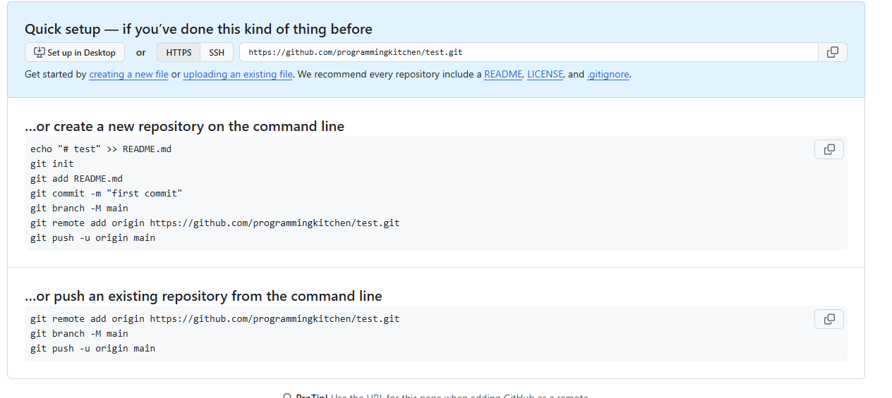

### Commands from Git Hub for HTTP access

```bash
echo "# test" >> README.md
git init
git add README.md
git commit -m "first commit"
git branch -M main
git remote add origin https://github.com/programmingkitchen/test.git
git push -u origin main
```

### Actual output 

- You will get some windows that require you to authenticate, but once you get through that: 

```bash
rhuser@DellXPS:~/github/test$ echo "# Test Repo" >> README.md
rhuser@DellXPS:~/github/test$ git init
hint: Using 'master' as the name for the initial branch. This default branch name
hint: is subject to change. To configure the initial branch name to use in all
hint: of your new repositories, which will suppress this warning, call:
hint:
hint:   git config --global init.defaultBranch <name>
hint:
hint: Names commonly chosen instead of 'master' are 'main', 'trunk' and
hint: 'development'. The just-created branch can be renamed via this command:
hint:
hint:   git branch -m <name>
hint:
hint: Disable this message with "git config set advice.defaultBranchName false"
Initialized empty Git repository in /home/rhuser/github/test/.git/

rhuser@DellXPS:~/github/test$ git branch

rhuser@DellXPS:~/github/test$ git add README.md 

rhuser@DellXPS:~/github/test$ git commit -m "First commit (#1)"
[master (root-commit) 71d10bd] First commit (#1)
 1 file changed, 1 insertion(+)
 create mode 100644 README.md
rhuser@DellXPS:~/github/test$ git branch -M main

rhuser@DellXPS:~/github/test$ git remote add origin https://github.com/programmingkitchen/test.git

rhuser@DellXPS:~/github/test$ git push -u origin main
Enumerating objects: 3, done.
Counting objects: 100% (3/3), done.
Writing objects: 100% (3/3), 233 bytes | 233.00 KiB/s, done.
Total 3 (delta 0), reused 0 (delta 0), pack-reused 0 (from 0)
To https://github.com/programmingkitchen/test.git
 * [new branch]      main -> main
branch 'main' set up to track 'origin/main'.
rhuser@DellXPS:~/github/test$ 

```

### Verify the results 

- What you seen in Git Hub after refreshing your browser. 

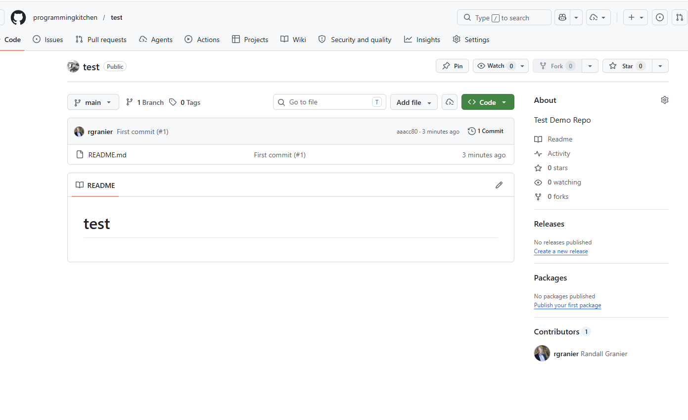


## Organizing and Investigating Local Repos at the CLI 

- As I mentioned earlier I like to put all of my Git Hub repos in a directory called "github."  This helps me distinguish between other repos like "Azure Dev Ops" which functions like Git Hub.  

- In WSL this looks like this: 

```bash
rhuser@DellXPS:~/github$ ls
azure-tf-blueprints  bash  MSSE640-2026Spring2  REGIS-MSSE  secondlinestories
rhuser@DellXPS:~/github$ 
```

- Each of the folders above is a local repo that is connected to a remote repo in git hub.  
- If you change to one of the directories, you can poke around with some commands.  
- Notice that in this directory there is a ".git" directory.  This stores all the magic.  If you ever get really stuck, you can delete the .git directory and start all over again.   

```bash
rhuser@DellXPS:~/github/REGIS-MSSE$ ls -la
total 56
drwxr-xr-x 13 rhuser rhuser 4096 May 10 18:46  .
drwxr-xr-x  7 rhuser rhuser 4096 Mar 23 14:07  ..
drwxr-xr-x  6 rhuser rhuser 4096 Mar 15 11:57  airlinereservation
drwxr-xr-x  2 rhuser rhuser 4096 May 11 18:51  cheatsheet
drwxr-xr-x  7 rhuser rhuser 4096 May 11 19:57  .git
drwxr-xr-x  2 rhuser rhuser 4096 Mar 14 11:16  JavaTriangle
drwxr-xr-x  3 rhuser rhuser 4096 Mar 14 11:16  MSSE640-2025summer
drwxr-xr-x  8 rhuser rhuser 4096 May 10 18:46  MSSE640-2026Spring2
drwxr-xr-x  3 rhuser rhuser 4096 Mar 14 11:19  MSSE642-2025Summmer
drwxr-xr-x  5 rhuser rhuser 4096 Mar 14 11:04  MSSE642-2026Spring
drwxr-xr-x  8 rhuser rhuser 4096 May 11 18:51 '!MSSE642-2026Summer1'
drwxr-xr-x  4 rhuser rhuser 4096 Mar 14 11:20  MSSE670
drwxr-xr-x  7 rhuser rhuser 4096 Mar 14 11:10  MSSE670-23Fall2
-rw-r--r--  1 rhuser rhuser  535 Mar 17 09:10  README.md
```

- Here are some other helpful commands that you can run on a local repo that is already set up. 

```bash
rhuser@DellXPS:~/github/REGIS-MSSE$ git remote -v
origin  git@github.com:programmingkitchen/regis-msse.git (fetch)
origin  git@github.com:programmingkitchen/regis-msse.git (push)
```

```bash
rhuser@DellXPS:~/github/REGIS-MSSE$ git branch
* feat/project-3
  main
```

```bash
rhuser@DellXPS:~/github/REGIS-MSSE$ git branch -r
  origin/HEAD -> origin/main
  origin/feat/project-3
  origin/main
rhuser@DellXPS:~/github/REGIS-MSSE$ 
```

- Let's look at the repo we just created.  

```bash
rhuser@DellXPS:~/github/REGIS-MSSE/test$ 
rhuser@DellXPS:~/github/REGIS-MSSE/test$ pwd
/home/rhuser/github/REGIS-MSSE/test
rhuser@DellXPS:~/github/REGIS-MSSE/test$ ls -la
total 16
drwxr-xr-x  3 rhuser rhuser 4096 May 12 11:14 .
drwxr-xr-x 14 rhuser rhuser 4096 May 12 11:12 ..
drwxr-xr-x  7 rhuser rhuser 4096 May 12 11:15 .git
-rw-r--r--  1 rhuser rhuser    7 May 12 11:14 README.md
rhuser@DellXPS:~/github/REGIS-MSSE/test$ git remote -v
origin  https://github.com/programmingkitchen/test.git (fetch)
origin  https://github.com/programmingkitchen/test.git (push)
rhuser@DellXPS:~/github/REGIS-MSSE/test$ git branch
* main
rhuser@DellXPS:~/github/REGIS-MSSE/test$ git branch -r
  origin/main
rhuser@DellXPS:~/github/REGIS-MSSE/test$ 
```

## Creating a local repo from one that already exists

### Getting the class repo (created by me)

- The repo that I created for this class is a public repo that you can clone (download) locally. 
- You cannot write to it (because I have not given you access), but you can pull all the changes that I make and see them on your local machine.  
- This will be helpful for things like directly copying the sample directory structure so you can use it without having to recreate it.  

> I made a temporary directory for cloning the class directory again.  This illustrates how all of the logic is contained in the directory and you can have many copies of local repos distributed anywhere you want. 


- To clone the class repo:

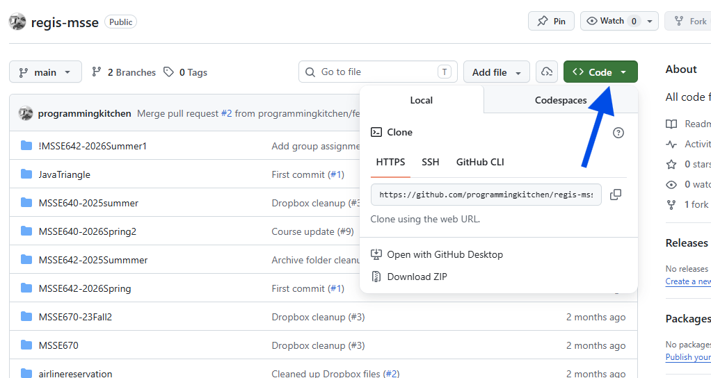

```bash
rhuser@DellXPS:~/foo$ git clone https://github.com/programmingkitchen/regis-msse.git
Cloning into 'regis-msse'...
remote: Enumerating objects: 1311, done.
remote: Counting objects: 100% (1311/1311), done.
remote: Compressing objects: 100% (493/493), done.
remote: Total 1311 (delta 294), reused 1262 (delta 247), pack-reused 0 (from 0)
Receiving objects: 100% (1311/1311), 15.97 MiB | 2.96 MiB/s, done.
Resolving deltas: 100% (294/294), done.

rhuser@DellXPS:~/foo$ ls
regis-msse

```

> NOTE: with this command syntax, a directory with the same name as the remote repo is created automatically in your current directory. 


## Integrating with VSC 

- The screen shot below represents a new VSC environment set up with everything I use.  
- Any IDE you choose will have these same capabilities.
- You will see:
    1. The left pane for files
    2. The middle pane where I code.
    3. The right pane where I use an AI agent (I use Git Hub Copilot).
    4. The bottom pane, which is a Bash terminal window connected to WSL.  
- You can set this up the way you like to work.  
- There are many extensions that you can install to provide additional functionality. 


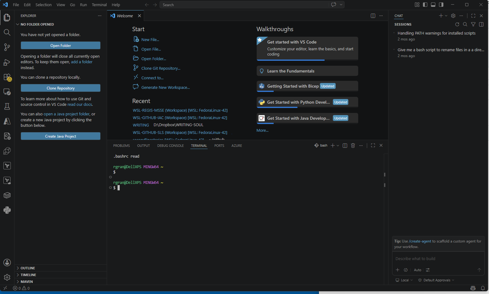


### Getting your new repo set up

- Select "Open Folder" and navigate to the folder that you 

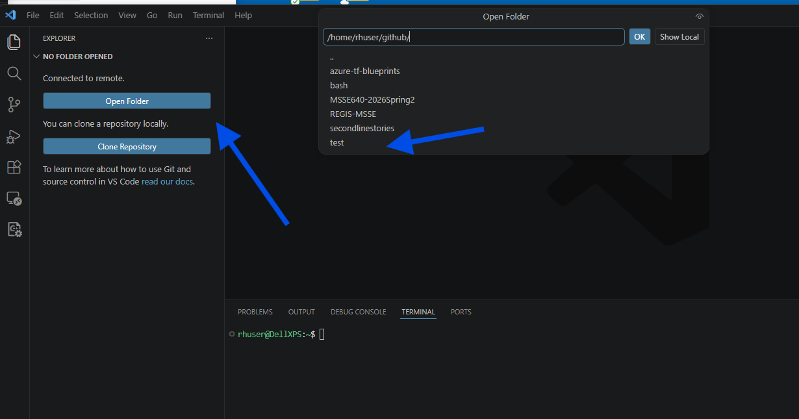

- Now you are almost ready to get started.  But there is one other thing.  
- I like to save my workspace (into a file).  That way, I will get my environment back by just opening the saved file.  
- I like to keep my workspace files at the root of my "github" directory. 

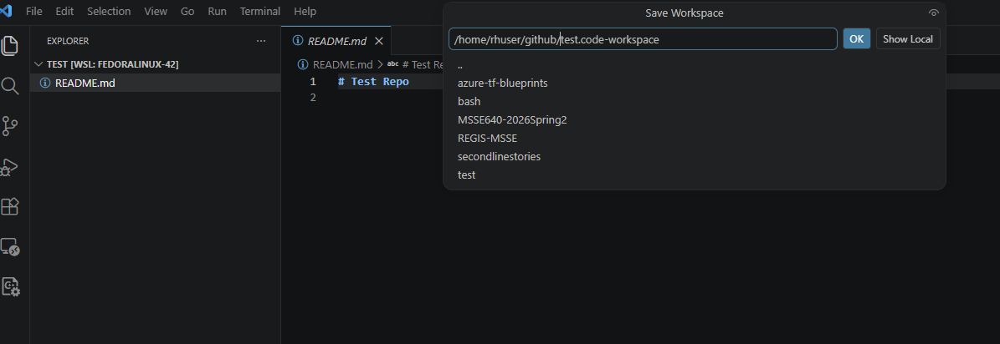


##  Git Branching Flow (recommended way)

###  Recommend way to work with branches

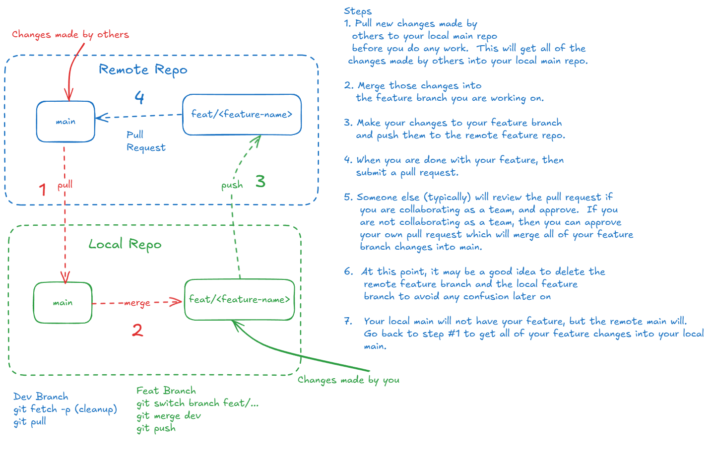

### Overview 

- When you first start using Git, you may be tempted to just work directly with the main branch.  This saves the step of integrating your changes into the main branch and then cleaning up by deleting your working branches.  This is not a big deal if you are working alone (I did it for years), but I would recommend starting off doing things the right way, even though it requires a few more steps.  
- When working in "the real world," you will always collaborte with others and you will always create branches for your work.  If the system is set up correctly, the main branch will be "protected" which means that you will not be allowed to write changes directly to it.   
- Git take a while to learn, especially when collaborating, so I recommend starting off doing things the right way.  
- It also provides an extra layer of protection since all your commits will be done to your working branch, not the main branch.  

> NOTE:  These instructions represent the right way to work with branches.  

### Using VSC to create a new branch and push your code to the remote branch.  

> NOTE:  You can do all of these steps from the command line, but I recommend using the VSC GUI.  The CLI can be helpful in checking things. 

- Click the little branch icon at the bottom, and create a new branch and name it based on "feature" or "fix."  For example, feat/test-branch
- The window at thye top will show you the local branches that exist as well as the remote branches, which you can tell because the start with "origin" 
- I'm working on the local feat-project-3 branch and I'm pushing my changes to the remote branch, origin/feat/project-3.
- But you don't have to worry about that once you are set up.  You just click buttons from here on out.  

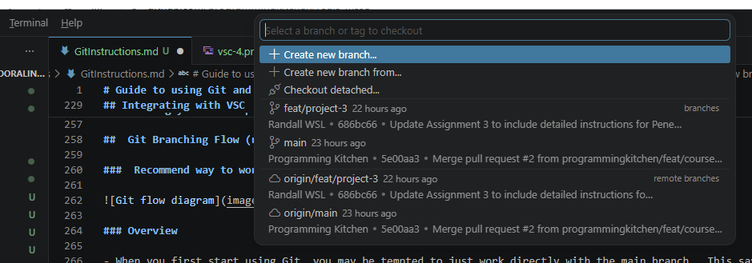

- After you save your changes and are ready to commit them and push them, select the branch icon on the far left.  You will see your changes and your commit history.  

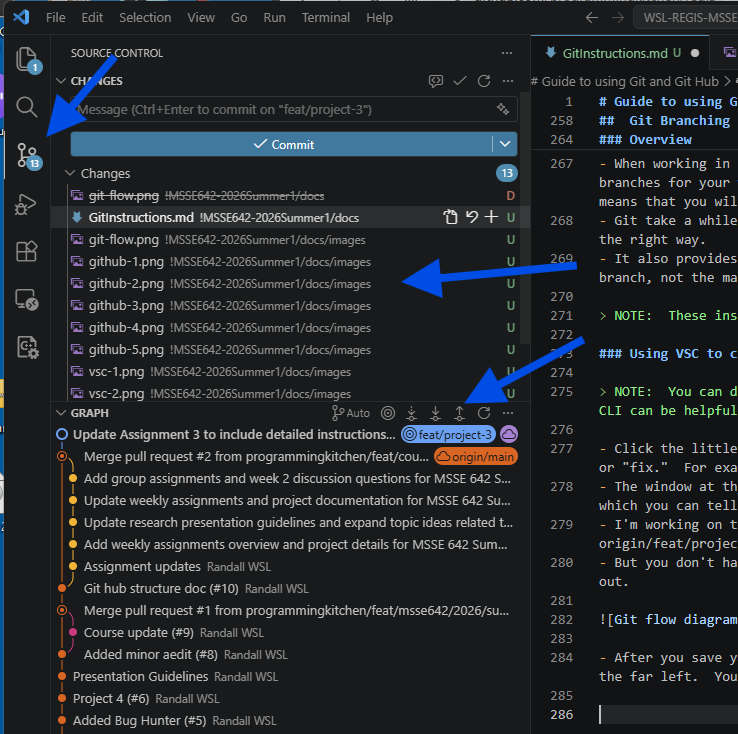

- The next step is to "stage" your changes.  This indicates that you want to commit the files that you staged.  Usually, you stage everything you changed, but you can select a subset of the files that you have changed.  
- Click the "+" icon on the "Changes" line to stage all of the changes.  
- Now you are ready to "Commit."  Commit saves the changes to the local repo.  
- You will need to write a commit message, but you can click the icon in the message window to let AI do it for you.  

- You can make multiple commit to your local repo, without pushing to the remote repo.  

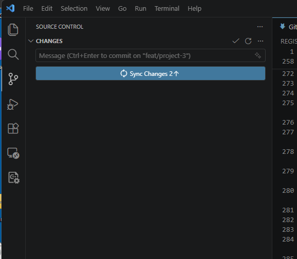

- The final step is to push the changes to the remote branch.  

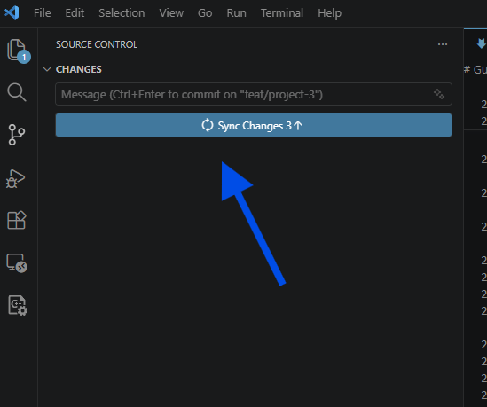

### Merging the remote branch with the main branch (and cleanup)

