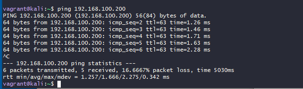
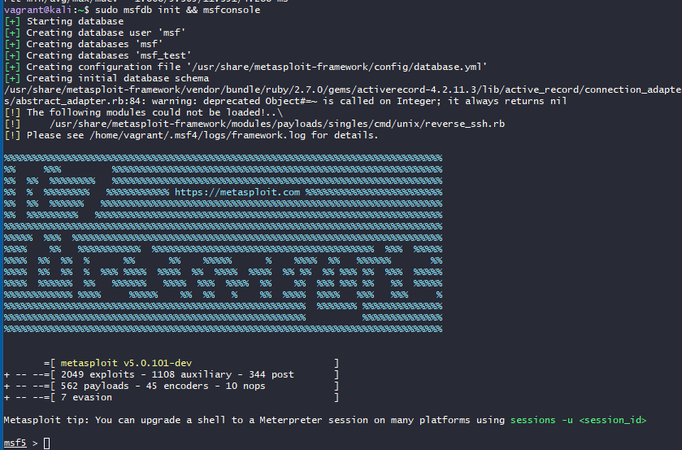
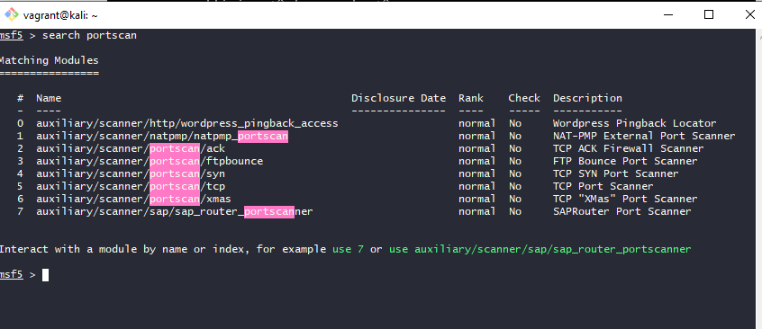
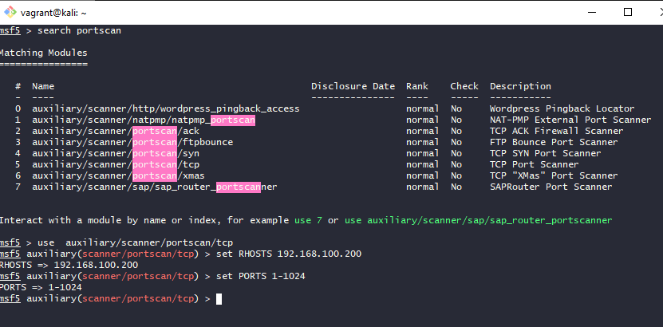
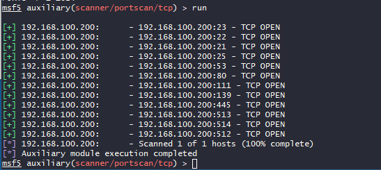

# HANDS-ON PROJECT 3

## Penetration Testing with Kali Linux, Metasploit, and Metasploitable2

## References

Singh, Glen (2019). *Learn Kali Linux 2019*. Birmingham, UK, Packt.  
Available at: <https://learning.oreilly.com/library/view/learn-kali-linux/9781789611809/>

## Prerequisites (Complete Hands On Assignment #1)

- You need to have Kali Linux and Metasploitable2 installed and running in a VirtualBox environment.
- You should be able to connect via the private network from your Kali Linux virtual machine to the Metasploitable2 virtual machine. You can do this via `ping` or `ssh`.

> [!WARNING]
> If you have issues with networking on the Metasploitable2 VM, you can use the following commands to set up networking. Ask questions in Slack if you have any issues.

```bash
sudo ip addr add 192.168.100.200/24 dev eth1
sudo ip link set eth1 up
```

> [!NOTE]
> When prompted for a password, use `msfadmin`.

> [!WARNING]
> Do not start the following section until you have completed the prerequisites.

## Part 1: Starting Metasploit Framework and Metasploitable 2

- Start both VMs: Kali Linux (Vagrant install) and Metasploitable2.

### SCREEN SHOT 1:   Take a screen shot showing both applications running and connected.


#### Example



- Start MetaSploit Framework with the following command
	
```bash
	sudo msfdb init && msfconsole
```

### SCREEN SHOT 2:   Show Metasploit up and running.

#### Example




## Part 2:   Use Metasploit Framework to perform a port scan of the target VM 

- Search of all of the possible scanners using the following command.  Try changing the search to reducte the scanners to port scanners only.

### SCREEN SHOT 3:   Show the port scanners (do not show all the scanners).

#### Example 



- Select the tcp port scanner using the "use" command

```bash
use  auxiliary/scanner/portscan/tcp
```

- Set the RHOSTS to the Metaspoitable2 VM.  If you have been using the examples provided, the IP address should be 192.168.100.200.  

```bash
set RHOSTS 192.168.100.200
```

- Set the ports to be scanned from 1 to 1024

```bash
set PORTS 1-1024
```

### SCREEN SHOT 4 :   Show the results of the procedure


- Run the scan using the RUN command

```bash
run
```
### SCREEN SHOT 5:   Show the results of the port scan.

#### Example




## Part 3: 

- Research one of the tools described in the Singh book, e.g. Maltego, Nessus, Burp Suit, etc. Cover the following topics on the Rubric. 
- Your choice of tools will impact how much information you can find and if you can use the tool in your Lab.  For example, Burp Suite is  a complex tool.   There are many current books written about it. 


Rubric Summary
| CRITERIA | SATISFACTORY | FAILING |
| --- | --- | --- |
| Introduction | Describe the tool and what it does, including who write it and the URL where it can be found. | Introduction is missing |
| Big Picture | Describe where this fits into the penetration testing process (see chapters of the Sing book and Chapter 8, page 257), e.g. Information Gathering, Scanning, etc. | Missing |
| Lab | Was the tool part of the default installation of Kali or did you have to install it? Were you able to use this tool in your penetration testing lab? Why or why not? If you were able to run a penetration test in your lab, briefly describe what you did and include a screen shot. | Missing |
| Conclusion | Contains a concluding paragraph that summarizes the tool | Missing |
| References | References are cited | Missing |


What to Submit
• Submit both parts of the assignment in a Word document with the following:

	1. All screenshots (4 total)
	2. Answer the following questions:
		a. What is the purpose of port scanning from the perspective of a Black Hat hacker?
		b. What is the purpose of port scanning from the perspective of a Ethical (White Hat) Hacker?
		c. Why did we restrict the scanned ports to 1 through 1024?

• The Word document should be named in the following format:  


