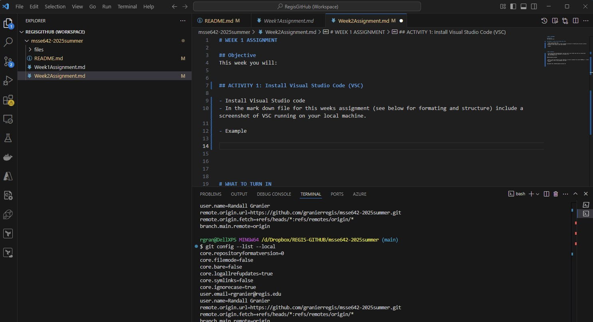
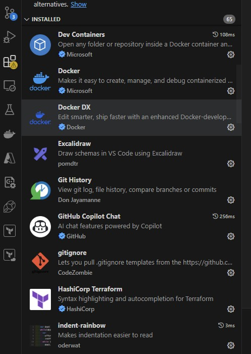
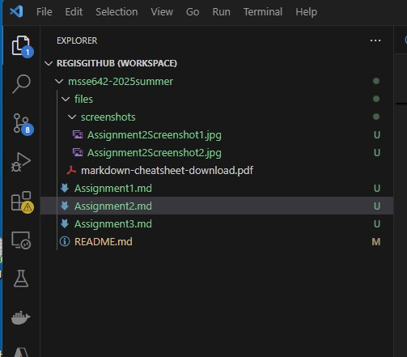
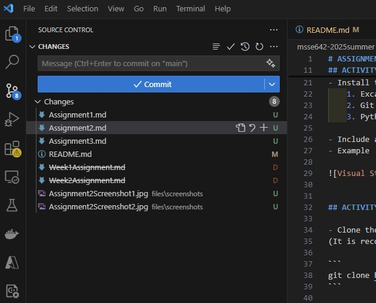
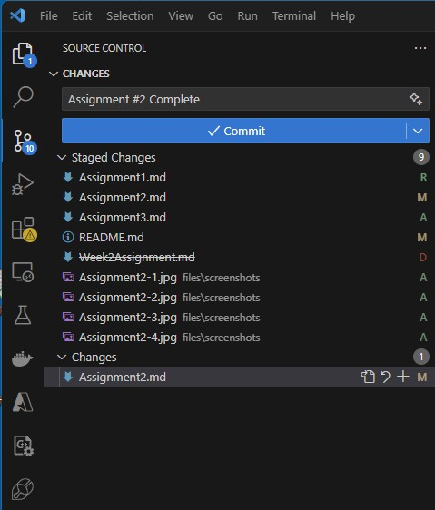
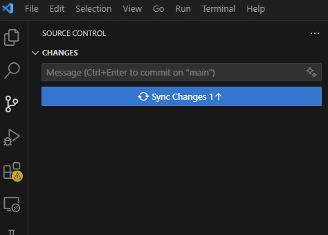

# ASSIGNMENT #2 (COMPLETE)

## Objective
This week you will:  
- Work with Visual Studio Code and Version Control
- Learn to write good markdown and a good README file. 

## PREREQUISITES  
- Windows users only: Git Bash installed (not necessary for Mac and Linux)
- Visual Studio Code installed
- Your local student repo 

## ACTIVITY 1: Configure Visual Studio Code (VSC)

- In VSC, open a terminal window, navigate to your repo, and issue some git commands at the CLI (see README.md for examples)
- In the mark down file for this weeks assignment (see below for formating and structure) include a screenshot of VSC running on your local machine. 

- Example




- Install the following extensions in VSC
    1. Excalidraw
    2. Git History
    3. Python (and any other Python extensions you might want)

- Include a screen shot of the extensions
- Example




## ACTIVITY 2: Clone the class repo and add to your VSC Workspace

- Clone the class repo so that you have a local copy of the repo.
(It is recommened that you clone the repo in the the parent directory as your personal github project)

```
git clone https://github.com/granierregis/msse642-2025summer.git
```

- Ensure that your student repo and the class repo folders are open in VSC.  Save as a VSC workspace.
- Include a screen shot showing both repos as part of the workspace.  

- Examples (only one repo included, you need two). 






## ACTIVITY 3: Writing a good readme file  

- Research what is included in a good README document for software.  Include a description and list of many of the things that make a good README file.  
- Use good formatting using capabilities of Markdown (See cheats in the main README file).
- Using VSC, stage your changes, commit with a meaningful commit message, and push to your remote repo using VSC. 






# WHAT TO TURN IN

- In the Slack channel #github-project, post the link to your GitHub repo that you created above when you are done.
- Your assignment will be completed in a markdown file. 
- Name the markdown file:

```
Assignment2<Lastname>
```

- Ensure in the root directory of your repository, you have a markdown file called "README.md."  In that file, include a link to the assignment this week. 
- Example: 

```
[Assignment #X](./Assignment#<Lastname>.md)
```

- Follow the directions above to ensure that your markdown file contains everything required for the assignment
