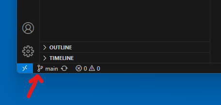
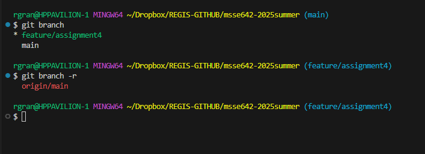
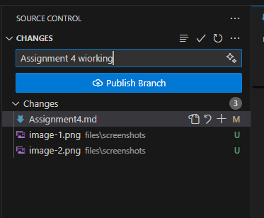
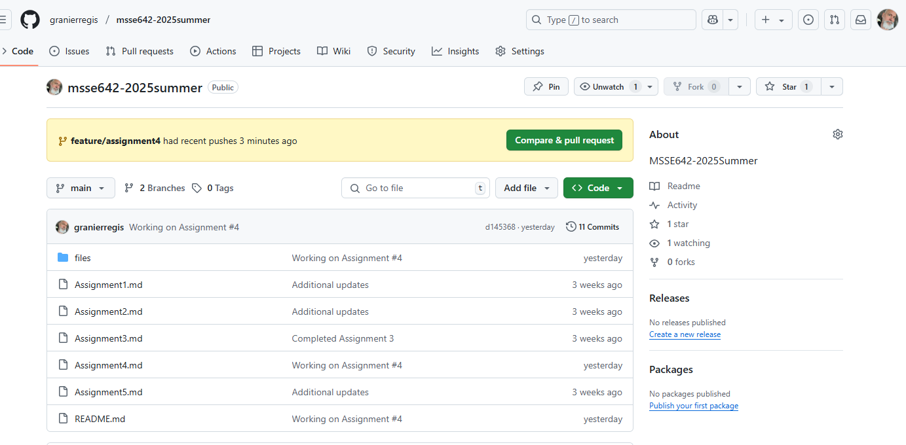
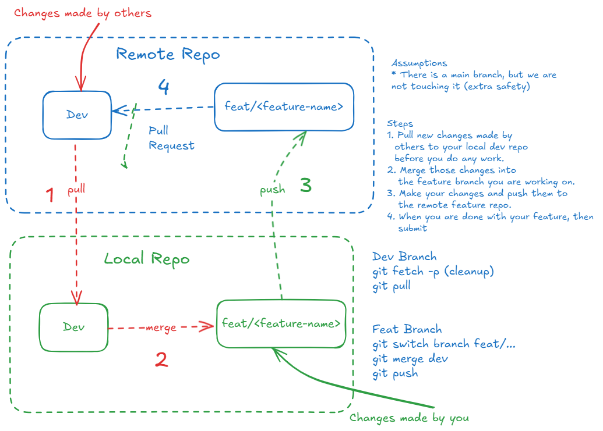

# ASSIGNMENT #4 (COMPLETE)

## Objective
This week you will:  
- Work with branches and a basic Git Flow

## PREREQUISITES  
You have a working remote repository. 

## ACTIVITY 1: 

### Background
- This week you will practice working with branches.  Often you will see a main branch, a dev branch, 
and several other branches that are used for new features, releases, or bug fixes.  
- The main branch is very carefully controlled and all of the developers will integrate their code into the dev branch, which will eventually be merged 
with the main branch after the code is known to work.   
- Several developers will work at the same time on different features and merge those into the dev branch.   

### What to do
1. Make your own feature branch and use that to make changes that will be merged into your main branch.   Optionally, you can also create a dev branch as described above.  The branch can be created at the command line, but try making your feature branch via Visusal Studio Code.  

- Click on the little branch icoon.
- In the popup window, click + Add new Branch



- You will see the branch at the bottom of the window, but you can also use the CLI, to see
the local and remote branches.   Is there a remote branch create yet?



- Commit your changes to the local repo branch and then publish it to the remote repo.  



- What is different when you run git branch and git branch -r?  

- When you are done making your changes, go to Git Hub (the URL), and issue a pull request to merge your feature branch on the remote repo.  This will also delete your remote feature branch.  Will the local feature branch still exist?  



- Since your feature is complete, then delete the remote repo.  First, run the following command 
to update the local metadata.  

```
git fetch -p
```


### A Typical Git Flow



# WHAT TO TURN IN

- In the Slack channel #github-project, post the link to your GitHub repo that you created above when you are done.
- Include screenshots for the steps above.  
- Your assignment will be completed in a markdown file. 
- Name the markdown file:

```
Assignment4<Lastname>
```

- Ensure in the root directory of your repository, you have a markdown file called "README.md."  In that file, include a link to the assignment this week. 
- Example: 

```
[Assignment #X](./Assignment#<Lastname>.md)
```

- Follow the directions above to ensure that your markdown file contains everything required for the assignment